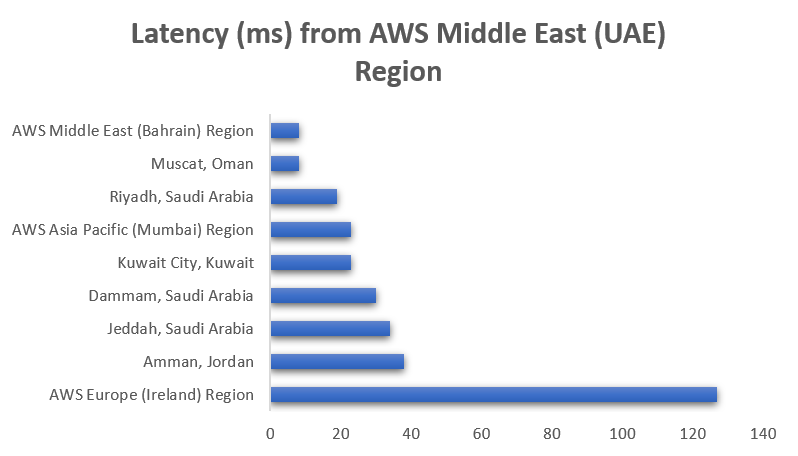
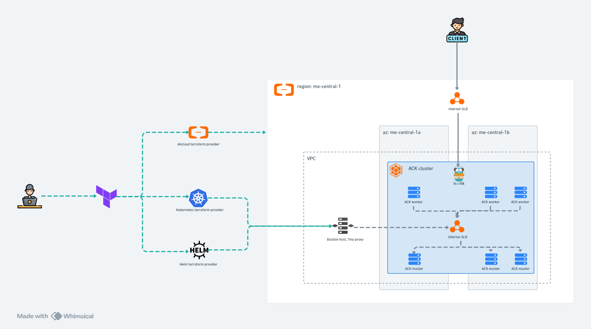
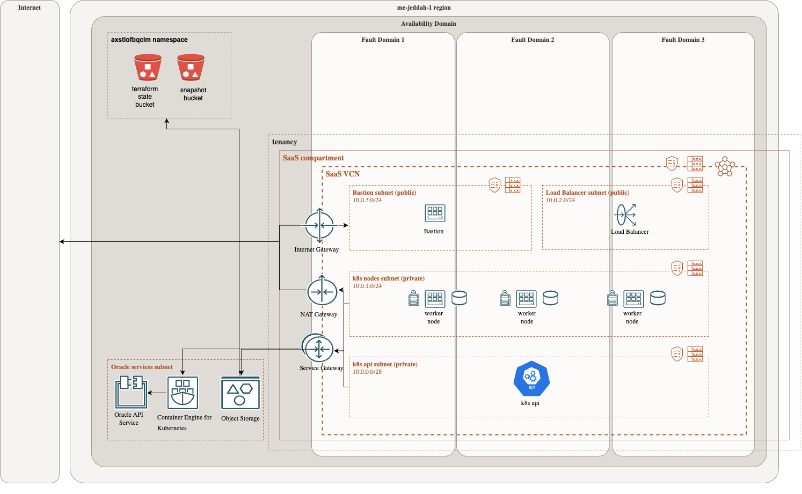
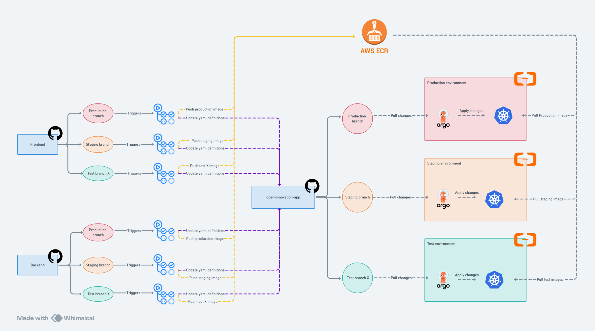
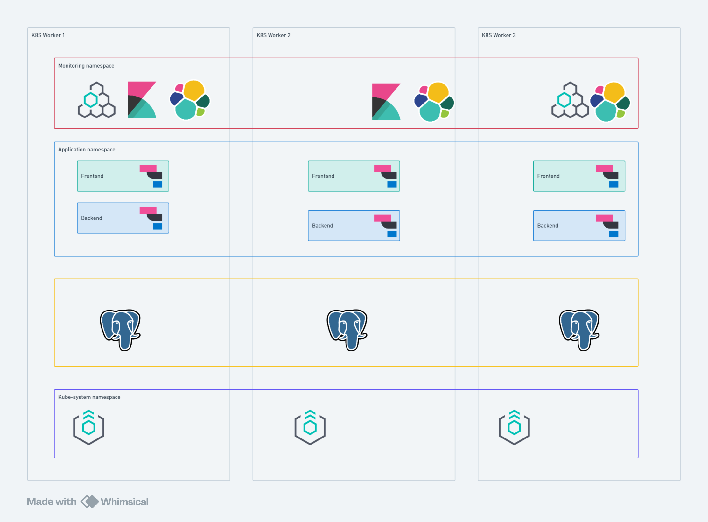

# open-innovation-SRE-challenge
This repository contains my solution for Open INNOVATION SRE challenge.

# 1 - Choose the infrastructure platform to use

Choosing the right infrastructure to use depends on multiple factors. First, we need to decide between using a Cloud environment or having the application deployed on premise. Multiple elements should be taken into consideration
## Cloud vs on-premise 
### 1. Cost 
Even though Cloud providers offer may sound a lot less expensive than buying your own Hardware, not having a clear and deep cost analysis over the desired timeframe can cause you a nightmare when you receive your bills.
### 2. Scalability 
How much does it take and how safe it is to scale UP/DOWN Horizontally/Verically. Of course, in this case Cloud will easily win considering the features most clouds provide (SaaS, Serverless, auto-scaling) and the fact that you only pay for what you use.
### 3. Security and Compliance 
Most cloud providers come with security and data protection standards (NIST, CCM,ISO 27001, GDPR). In the other hand, you have to work on this part if you choose to buy your own hardware.
### 4. Readinesse
Cloud providers offer well-known softwares and tools that are difficult to deploy and manage as a ready to use service for example Kubernetes managed service, Kafka streaming service etc.
### 5. Cross-regions availability
 Cloud can insure High avaialilty because of the cross region fault tolearance. It can also bring client's data to their geo location.

Cloud is actually the choice of most companies nowadays. Going Hybrid is a third option for some companies that already has a fully functionning and stable enviroment and wants to get some of the features provided by the cloud.

Another point to discuss is which cloud provider to choose from the list. AWS, GCP, Azure are the most popular ones. However in countries which has strict Data policies and these 3 cloud providers are not available to use in the region like Saudi Arabia (recently GCP started there), Oracle cloud and Alibaba cloud can be the only choice they have.

## Cloud providers
### 1. Cost
Comparing the offers each cloud suggests is crucial. Some clouds has some interesting offers for startups.

### 2. Clients/datacenters location
Depending on where our primary clients are located, and which clouds are available on that location, we can decide. Having a cloud data center near the client or a network edge can reduce the network latency.
This is an example of how location can affect latency:

- AWS has 2 regions in the middle east  (Bahrain, UAE)  with 3 availablity zones.
- GCP has 2 regions in middle east (KSA, Qatar) with 3 AZ each.
- Azure has 2 regions (UAE, Qatar)
- Alibaba has 2 regions (UAE 1 AZ, KSA 2 AZ - partner region).
- Oracle has 3 regions (KSA, UAE) with one AZ each.

Considering that some applications will require at least 3 replications to function properly like Elasticsearch masters nodes, having 3 availabilty zones is a must sometimes. 

### 3. Platform services
Different cloud providers provide a wide range of services. AWS has a huge number of services and it is being increased at a rapid pace. This opens another discussion, do we opt for using Cloud Managed services , or we just purchase compute instances and we manage tools by ourselves. Managed services could be a more expensive option but it could avoid us a lot of pain considering that it has proven itself over the years. In our use case we can use AWS RDS for PostgreSQL, which will manage postgres for us. Also we can use AWS EKS, or any cloud managed kubernetes service. Kafka Managed service is a good option sometimes. 

## Conclusion
Choosing the right infrastructure really depends on multiple factors. It has no right answer considering the provided inputs. this choice can also be done depending on companies stuff skills and experience. If there is no strict requirements about location, I can go for Alibaba Cloud considering the price and the fact that it has 3 availability zones on middle east and considering also my previous experiences with this cloud. If I get more specifications about the deployed application and the services it needs, I may go for AWS considering its huge fleet of services and the fact that it holds about 33% market share by 2024.

# 2 - Choose the orchestration technology and their components
I choose Kubernetes but I will opt for a cloud fully managed kubernetes. Alibaba Cloud offers a service called ACK which stands for Alibaba Container service for Kubernetes. I used it several times before and it works really well for production grade deployments. We will also benefit from the various advantages provided by the cloud.
The orchestration technology will be composed of an ACK instance which represents Kubernetes controller plane. This instanse is fully managed by Alibaba cloud. We will have also a node pool of worker nodes distributed across the available zones. we can also integrate tools like Kyverno to apply some policies on the cluster. 

We can use ArgoCD to automate application deployment. Also Traefik will be installed for our ingress.

# 3 - Describe the solution to automate the infrastructure deployment and prepare the most important snippets of code/configuration

To automate infrastructure deployment, I will be using Terraform. Alibaba cloud offers a [terrafrom provider](https://registry.terraform.io/providers/aliyun/alicloud/latest/docs) that we can use to define and deploy resources in the their cloud.

The ACK cluster will have 3 worker nodes distributed across the Availlable AZ to insure fault tolearance across AZ. We can even go further and distribute the worker nodes across regions.

A jump or bastion host is added with TinyProxy inside to have an additional layer for security. kubernetes server API can be privately accessed throw this bastion host.

For more details please check [Alibaba provisioning](https://github.com/TarekROCs/open-innovation-SRE-challenge/tree/main/terraform/layer1-alibaba-provisioning) sub directory.

A helm terraform provider is used to deploy traefik, sealed secrets, ECK operator and ArgoCD helm charts for later use. 
Check [Helm charts](https://github.com/TarekROCs/open-innovation-SRE-challenge/tree/main/terraform/layer2-helm-charts) sub directory.

PostgreSQL also can be deployed using Helm provider. For production, we use [Bitnami helm chart](https://github.com/bitnami/charts/tree/main/bitnami/postgresql-ha) because it comes equiped with tools to manage a highly available postgreSQL cluster for production (pgpool, backup etc.). 

the following picture shows an equivalent archtitecture in Oracle cloud. No code is prepared with this diagram. I just wanted to show the similarities. 

# 4 - Describe the solution to automate the microservices deployment and prepare the most important snippets of code/configuration

To automate the microservices deployment, we are going to use Github Actions a long with ArgoCD. let's suppose we have two repository. One called frontend and another one called backend. frontend and backend both have its own set of variables which we can save inside github secrets. 

We need to create a third repository. Let's call it open-innovation-app. This repository will contain the Kubernetes yaml files for frontend and backend. Each yaml file will contain an image id which will be updated each time a new image version of the app is created. This update is done using two github actions pipelines run from frontend and backend repositories.

basically the pipeline will do the following:
  1. Build a docker image using a predifined dockerfile, sign it with cosign and push it to AWS ECR. A kyverno policy will be added to accept only signed images with a provided key.
  2. Pull open-innovation-app repository and update the yaml files image IDs and configurations.
  3. Push modified yaml files to open-innovation-app repository.

We can have another  pipeline that will check github secrets and seal them using a provided sealing key. 

open-innovation-app repository contains also traefik Ingress routes and secrets needed for PKI infrasture.

ArgoCD should watch open-innovation-app repository and automatically apply changes once detected. Also it is better to create a private github runner which can be deployed inside alibaba infrastructure so that it can access the environement privately.

Check [Actions](https://github.com/TarekROCs/open-innovation-SRE-challenge/tree/main/actions) sub directory.

# 5 - Describe the release lifecycle for the different components

The standard lifecycle of a release requires 6 phases/versions: Pre-Alpha, Alpha, Beta, Release Candidate, General Availability and Production Release. We wont go throw the definition of each phase. Instead let's make it simpler for our simple application. In our setup, we have a production environment to which the client has access to, a staging environment which should be a clone of the production environment but only the company members has access to. Finally, we have a test environment which can look like Production but with less resources in order to reduce cost. The test environment can hold multiple test application instances each one in a different kubernetes namespace.

Each time a new pull request is merged into one of the branches, a github actions pipeline will automatically (or mannually for test branches) be triggered. It will build an image, sign it and push with the right tag. It will also pull open-innovation-app repository, modify the yaml files in the corresponding branch.

Once ArgoCD detects changes on open-innovation-app repository, it will pull the changes and apply it in the kubernetes cluster. 

# 6 - Describe the testing approach for the infrastructure
For testing the infrastructure without the application layer, we can use terraform test framework. It will allow to make unit tests on terraform resources before applying the changes.

If with this question, you mean testing the hole stack, we can choose tools like Selenium for functional testing. We can integrate Unit tests in Github actions pipeline. Depending on the used framework, we can add test actions. For example for nodejs applications, we add nodes js specific test actions. Github actions actually comes with a set of predifined unit tests. 

# 7 - Describe the monitoring approach for the solution
Elastic ecosystem is a great monitoring tool. First we need to deploy a small elasticsearch deployment (better to have it in a separate environment). Then, we need to deploy Elastic agent inside the kubernetes worker nodes. It will be deployed as deamonset with Elastic kubernetes integration enabled.

Also to monitor application level performance, we can make use of Elastic APM ( ELastic agent with APM integration). With Elastic APM, we can see how much time each request is taking inside hte application, and on which application part it is taking most of the response time so that we can focus on it and improve it.

For postgreSQL. we can use Elastic agent with postgreSQL integration enabled or we can use the same one previousely added for kubernetes and enable postgreSQL integration on it.

Detection rules and watchers can be enabled to send alerts to slack or email if something wrong happens to the application or to the cluster.

One thing I like always to add is kubernetes dashboard. It may give us a better view on the cluster.

Check [kubernetes manifests](https://github.com/TarekROCs/open-innovation-SRE-challenge/tree/main/terraform/layer3-k8s-manifests) sub directory.

